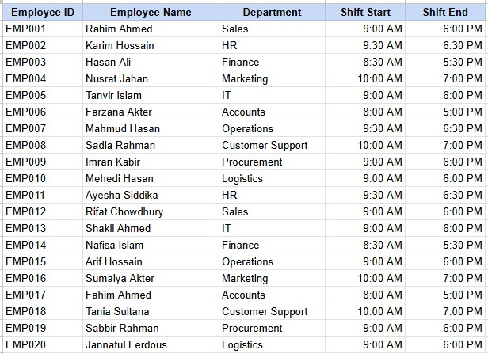
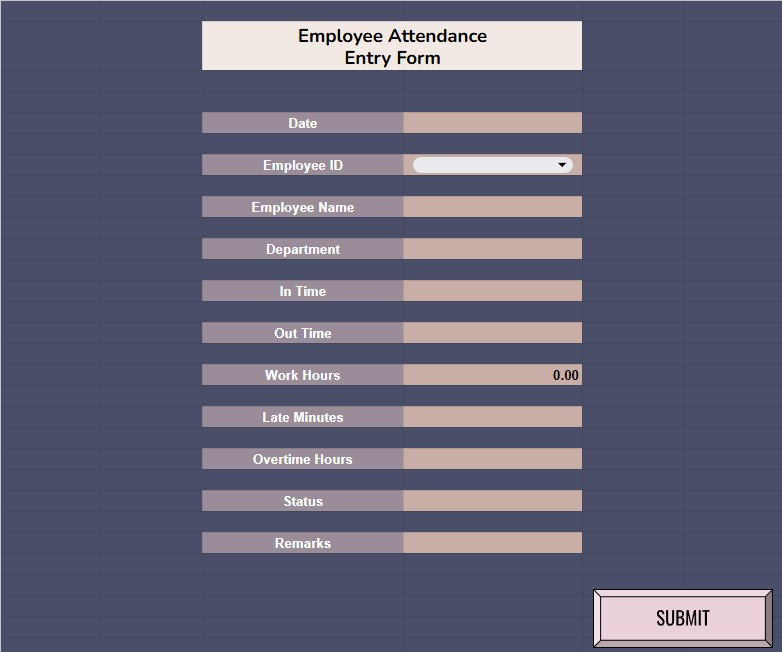
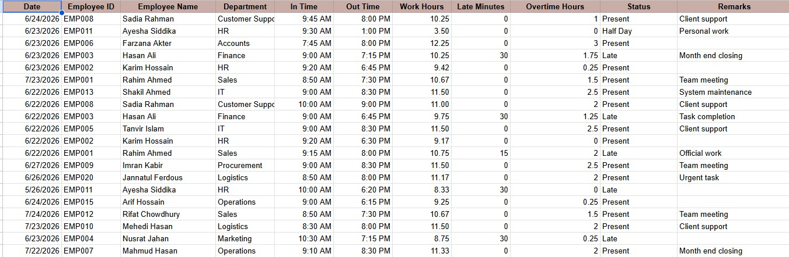
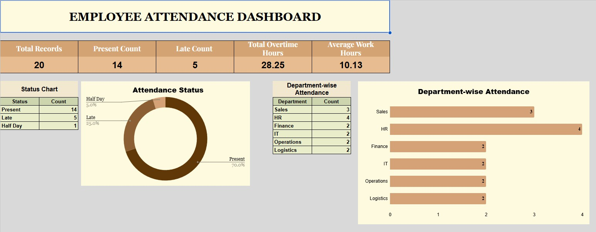

# Employee Attendance Automation System

An automated employee attendance management system built in Google Sheets to simplify attendance recording and reporting.

## Features

- Automated attendance entry form
- Employee lookup using XLOOKUP
- Automatic work hours, late minutes, overtime, and status calculation
- One-click attendance submission using Google Sheets Macros
- Interactive attendance dashboard

## Tools

- Google Sheets
- Google Sheets Macros
- XLOOKUP
- Dashboard
- Data Validation

## Project preview

The project contains four main sections:

1. **Employee List**  
   Stores employee master data including Employee ID, Employee Name, Department, Shift Start, and Shift End.

   

3. **Attendance Entry Form**  
   Used to enter daily attendance information.

   

5. **Attendance Database**  
   Stores all submitted attendance records in a structured format.

   

7. **Dashboard**  
   Provides summary insights using KPI cards and charts.

   

## Project Documentation (PDF)

[Project Documentation (PDF)](docs/Employee_Attendance_Automation_System.pdf)

## Live Demo

📊 **Google Sheets (View Only):**
https://docs.google.com/spreadsheets/d/1VHDT34BUAHPU7A3YGG8L3_DmHi0rWzacZKzIcZI-vtk/edit?usp=sharing
